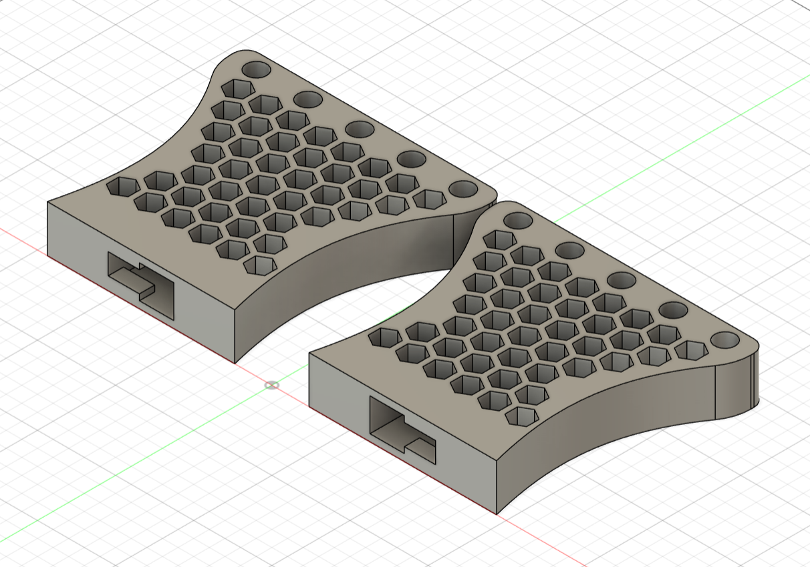
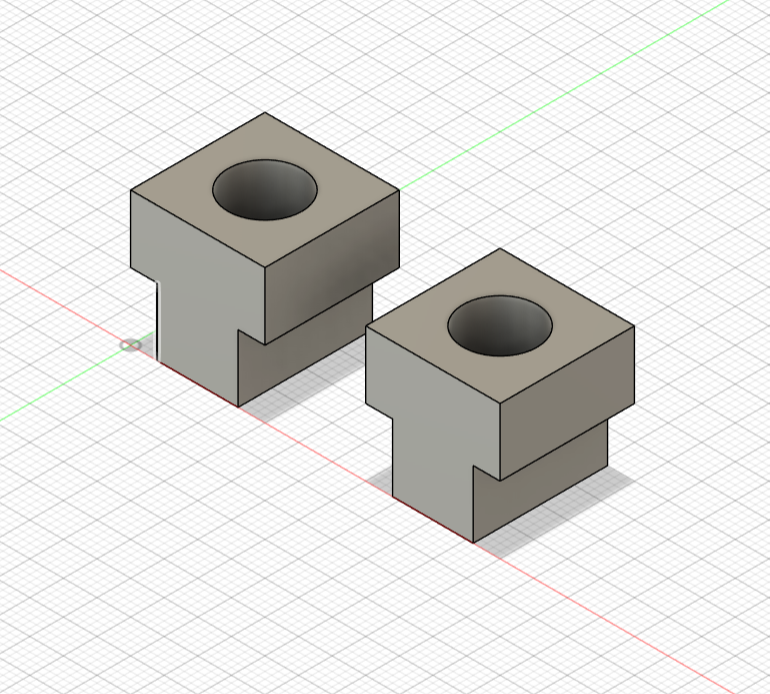
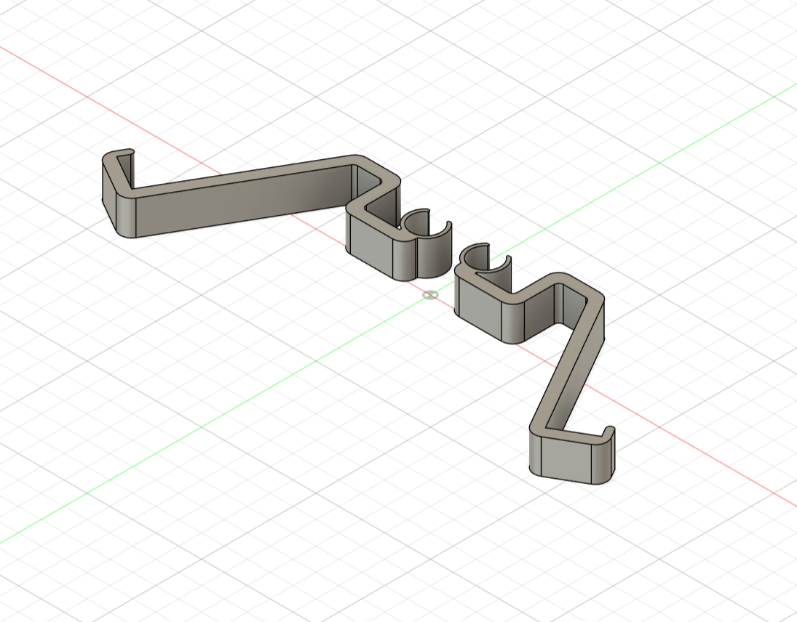
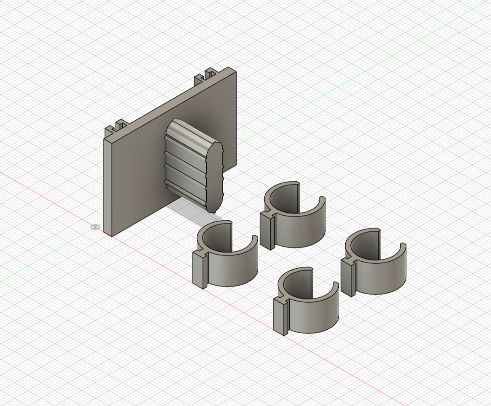
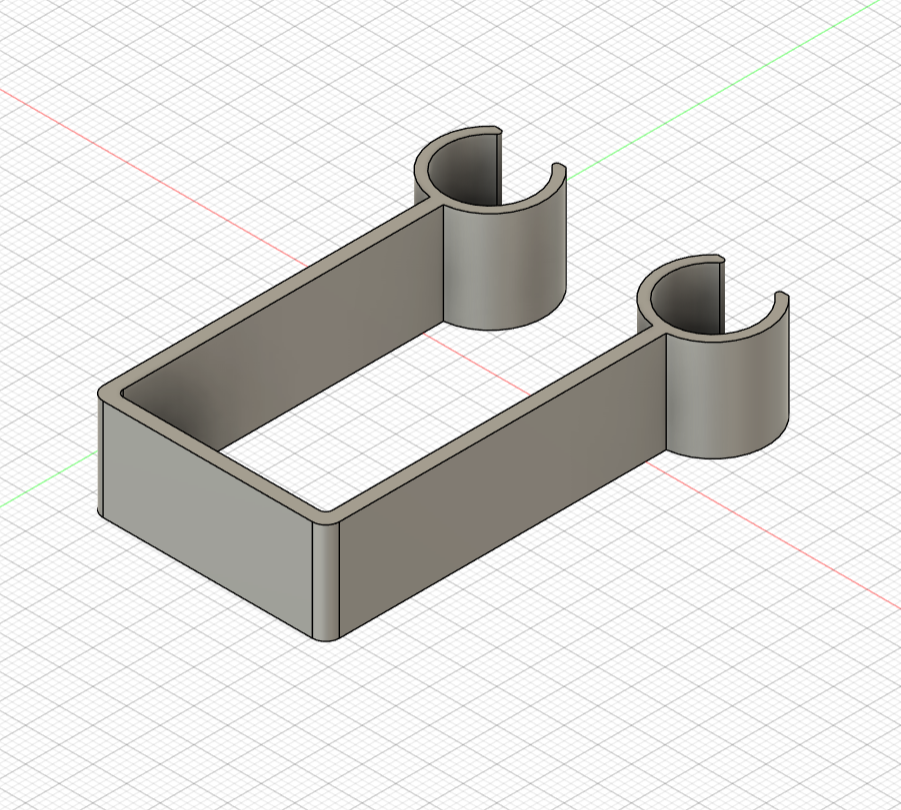
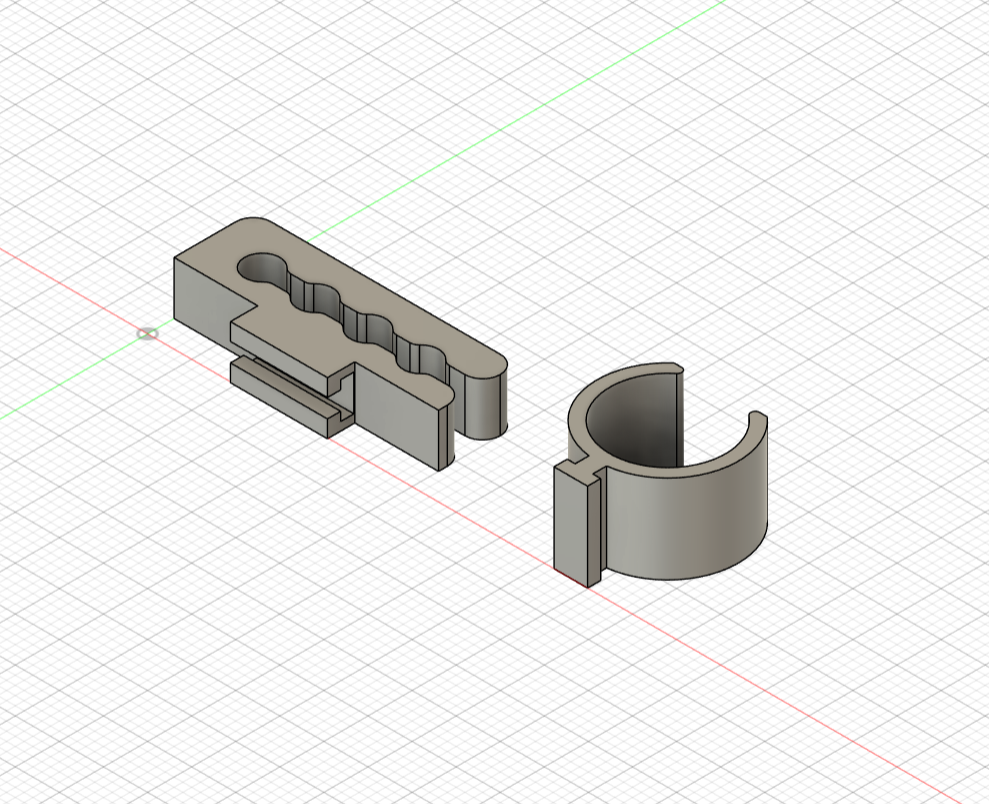

# Desk Shelf

A 3D-printable modular and extendable desk shelf system, designed to organize your workspace and expand with
accessories.

This project was designed in **Autodesk Fusion** and the repository includes both the **Fusion project files** and
**.3mf files** preconfigured for the **Bambu Lab P1S** 3D printer.

## Required materials

- ~460g of PLA filament
- 4-5 tubes with a 13.1 mm outer diameter
- 2 M4 40mm screws
    - The length depends on your desk thickness
    - Shelf mounts require at least 10 mm of thread engagement to be fully secured
    - You have up to 10 mm of extra space to “hide” additional screw length

## Main parts

### Side stands

- **Filament required:** ~356.8g
- **[Side stands project files](side-stands)**

3D view

---

### Shelf mounts

- **Filament required:** ~8.5g
- **[Shelf mounts project files](shelf-mounts)**

3D view

---

## Accessories

### Tray

- **Filament required:** ~57.4g
- **[Tray project files](tray)**

3D view

---

### Phone stand

- **Filament required:** ~17.7g
- **[Phone stand project files](phone-stand)**

3D view

---

### Headphones stand base

- **Filament required:** ~9.7g
- **[Headphones stand base project files](headphones-stand-base)**

3D view

---

### Notebooks holder

- **Filament required:** ~7.1g
- **[Notebooks holder project files](notebook-holder)**

3D view

---

### Cables holder

- **Filament required:** ~2.4g
- **[Cables holder project files](cables-holder)**

3D view

