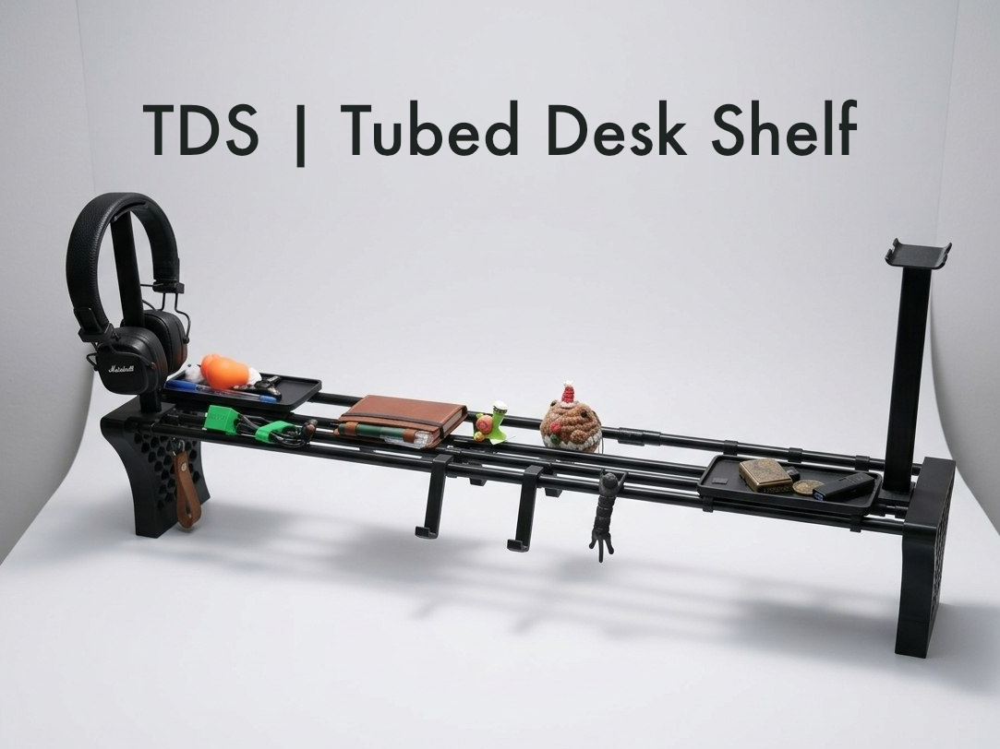
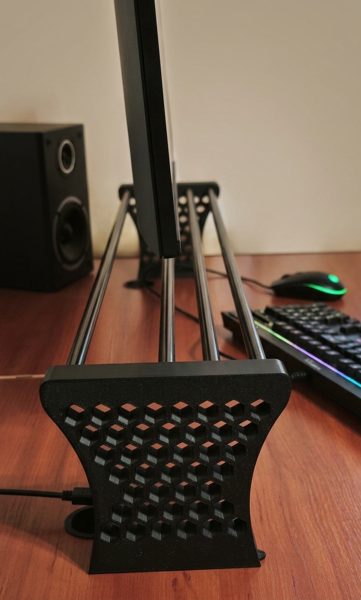
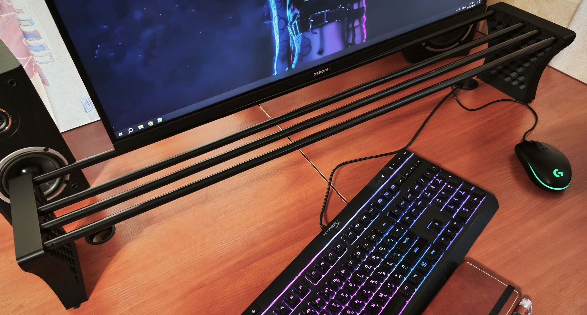
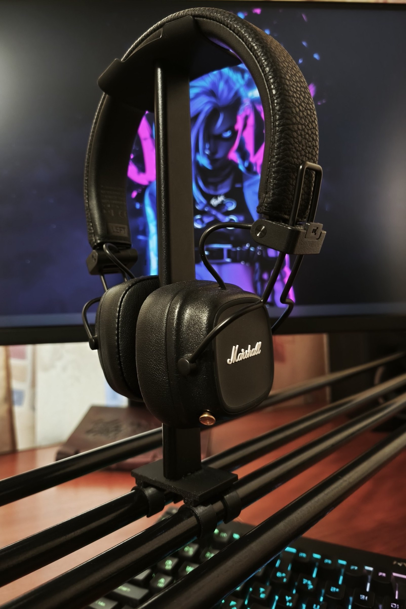
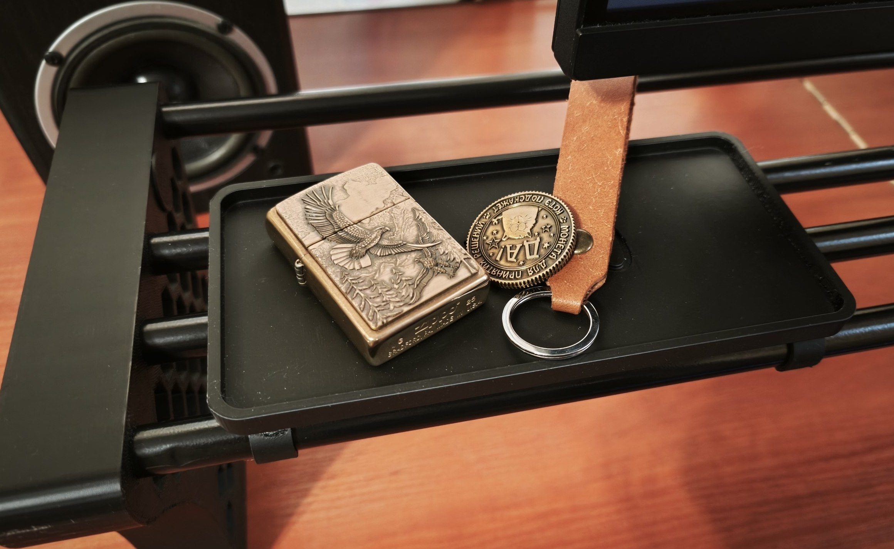
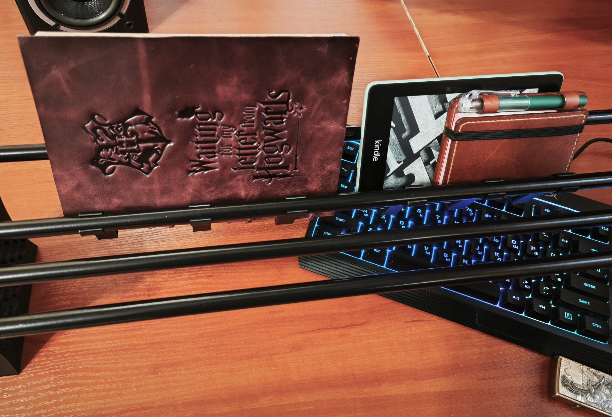

# TDS | Tubed Desk Shelf

 

**TDS** is an open-source, 3D-printable modular system designed to organize and elevate your workspace.
The structure is built around side supports and five 13mm-diameter tubes/rods of any material - such as aluminum, wood,
or carbon fiber. These core elements form the basic TDS, which you can secure it to your workspace using the dedicated
table mounts and expand its functionality with the initial set of compatible accessories, or design your own custom
additions. I also welcome your ideas and proposals for future expansions

**TDS** project was designed in **Autodesk Fusion** and the repository includes both the **Fusion project files** and
**.3mf files** preconfigured for the **Bambu Lab P1S** 3D printer

## Links

- [Maker World](https://makerworld.com/en/models/2803112-tds-tubed-desk-shelf#profileId-3118631)

## Ecosystem

- **Main parts**
    - [Tubed Desk Shelf](tubed-desk-shelf)
- **Accessories**
    - [Intermediate Supports](intermediate-supports)
    - [Headphones stand](headphones-stand)
    - [Tray](tray)
    - [Phone stand](phone-stand)
    - [Notebooks holder](notebook-holder)
    - [Cables holder](cables-holder)
    - [Templates](templates)
    - [Headphones stand base](headphones-stand-base)

## Specs

### Dimensions

- **Height:** 150mm
- **Width:** depends on the tube length you choose
- ⚠️ **NOTE** ⚠️
    - When marking the holes, keep in mind that each screw hole should be positioned **~39mm behind the front edge of
      the side stand** - this ensures that the shelf will sit exactly where you want it on your desk
    - Keep in mind that some accessories, or certain ways of using them, may require additional vertical space -
      consider this when positioning the shelf

### Required materials

- ~292g of PLA filament for the base shelf
- ~445g of PLA filament for the base shelf and accessories
- 5 tubes/rods with a 13mm outer diameter
- 2 x M4 x 30mm screws
    - The screws length depends on your desk thickness

## Preview

