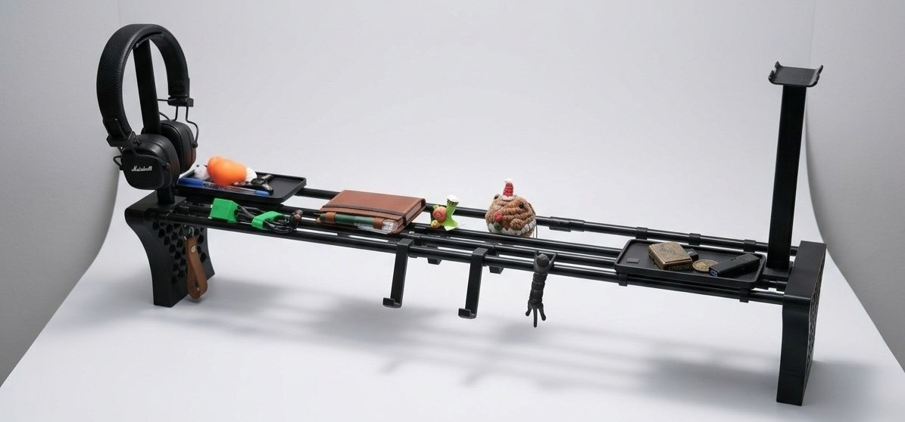

# TDS | Tubed Desk Shelf

3D-printable, modular, and extendable desk-shelf system designed to organize your workspace and grow with
additional accessories. Its primary components form the base for five 13mm-diameter tubes/rods and their compatible
accessories

**TDS** project was designed in **Autodesk Fusion** and the repository includes both the **Fusion project files** and
**.3mf files** preconfigured for the **Bambu Lab P1S** 3D printer

---

**Dimensions:**

- **Height:** 150mm
- **Width:** depends on the tube length you choose
- ⚠️ **NOTE** ⚠️
    - When marking the holes, keep in mind that each screw hole should be positioned **~39mm behind the front edge of
      the side stand** - this ensures that the shelf will sit exactly where you want it on your desk
    - Keep in mind that some accessories, or certain ways of using them, may require additional vertical space -
      consider this when positioning the shelf

**Required materials:**

- ~293g of PLA filament for the base shelf
- ~445g of PLA filament for the base shelf and accessories
- 4-5 tubes with a 13mm outer diameter
- 2 x M4 x 40mm screws and 2 x M4 nuts
    - The screws length depends on your desk thickness
    - The shelf mounts require at least 10mm of thread engagement to be fully secured

## Parts

- **Main parts**
    - [Tubed Desk Shelf](tubed-desk-shelf)
- **Accessories**
    - [Headphones stand](headphones-stand)
    - [Tray](tray)
    - [Phone stand](phone-stand)
    - [Notebooks holder](notebook-holder)
    - [Cables holder](cables-holder)
    - [Tube brackets](tube-brackets)
    - [Headphones stand base](headphones-stand-base)
