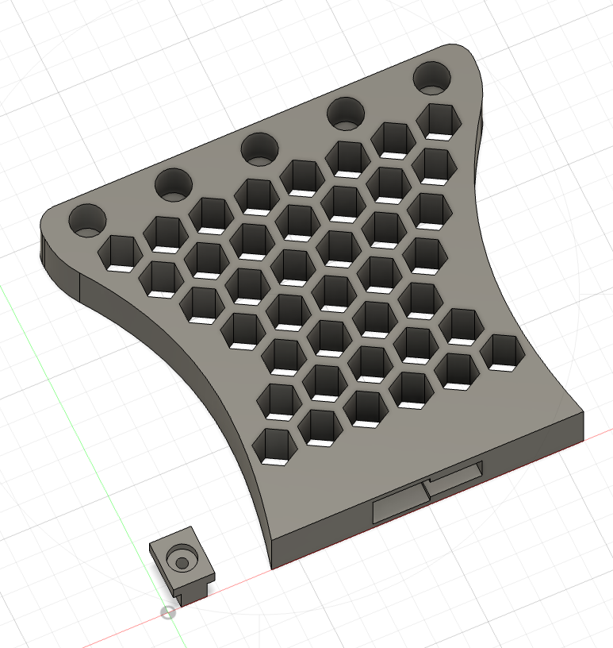
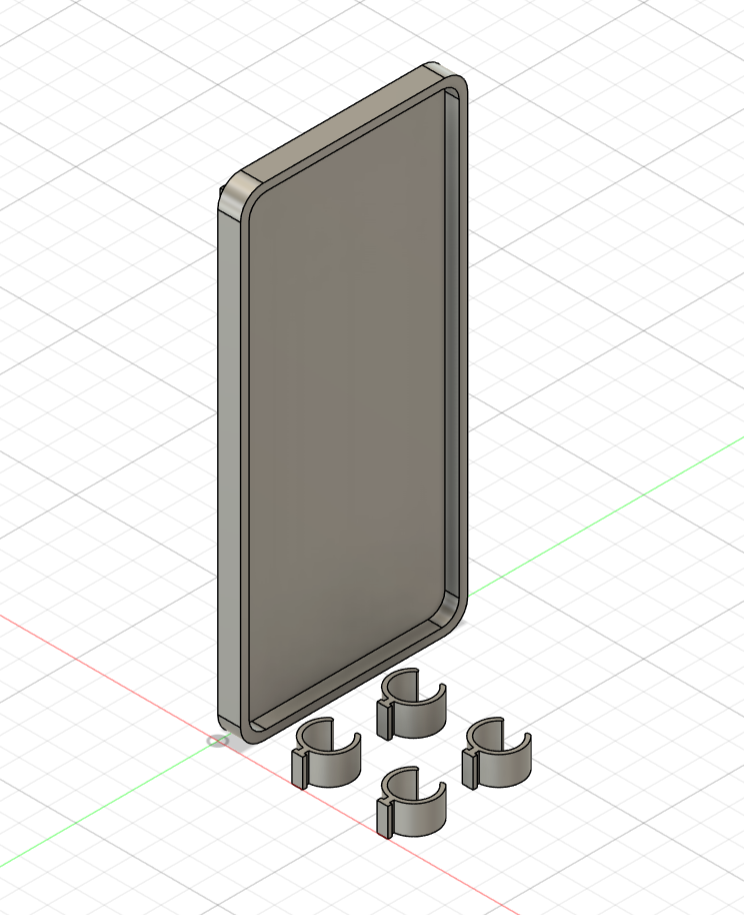
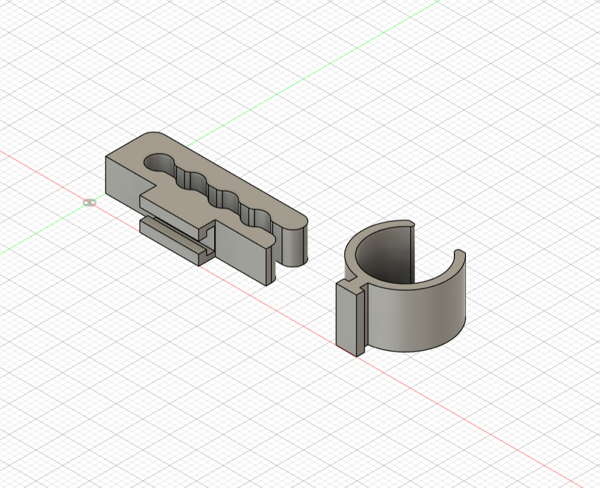

# TDS | Tubed Desk Shelf

TDS is a 3D-printable, modular, and extendable desk-shelf system designed to organize your workspace and expand with
accessories

This project was designed in **Autodesk Fusion** and the repository includes both the **Fusion project files** and
**.3mf files** preconfigured for the **Bambu Lab P1S** 3D printer

**Dimensions:**

- **Height:** 150mm
- **Width:** depends on the tube length you choose
- ⚠️ Keep in mind that some accessories, or certain ways of using them, may require additional vertical space - consider
  this when positioning the shelf

**Required materials:**

- ~293g of PLA filament for the base shelf
- ~445g of PLA filament for the base shelf and accessories
- 4-5 tubes with a 13.1mm outer diameter
- 2 x M4 x 40mm screws and 2 x M4 nuts
    - The screws length depends on your desk thickness
    - The shelf mounts require at least 10mm of thread engagement to be fully secured

## Main parts

### TDS | Tubed Desk Shelf

The primary components of the shelf that act as the base for the five 13.1mm-diameter tubes and their associated
accessories

Preview

- **Filament required:** ~293g
- **Installation:**
    - Choose the desired position for your shelf
    - Drill holes for M4 screws, and secure the mounts with M4 screw and nut
    - ⚠️ When marking the holes, keep in mind that each screw hole should be positioned **~49mm behind the front edge of
      the side stand** - this ensures that the shelf will sit exactly where you want it on your desk
    - Place the side stands onto the installed shelf mounts and slide them away from you (toward the back
      of the desk) until they lock in place
- **[Shelf project files](tubed-desk-shelf)**

---

## Accessories

### Tray

A modular accessory that attaches to the shelf and provides a convenient space for pens, cables, or other small items
you use frequently

Preview

- **Filament required:** ~59g
- **[Tray project files](tray)**

---

### Phone stand

A width-adjustable stand suitable for holding various devices such as phones, tablets, or e-readers. 
Provides stable support and integrates seamlessly with the shelf system

Preview

- **Filament required:** ~22g for the pair
- **[Phone stand project files](phone-stand)**

---

### Notebooks holder

A flexible holder that attaches to the shelf’s tube system and can hold notebooks, books, or other flat items.  
It can be mounted between neighboring or more distant tubes

Preview

- **Filament required:** ~14g for the pair
- **[Notebooks holder project files](notebook-holder)**

---

### Cables holder

Mounts on the shelf tubes and keeps your keyboard, mouse, or other cables organized.  
You can also use it to hang small accessories or tools

Preview

- **Filament required:** ~3g
- **[Cables holder project files](cables-holder)**

---

### Tube brackets

Brackets that serve as mounting points for the shelf’s tube system.  
They can also be combined with accessories to provide additional mounting positions or support.  
One of the bracket variants includes a slot for an 8mm diameter constant magnet

Preview

- **Filament required:** ~1g
- **[Tube brackets project files](tube-brackets)**

---

### Headphones stand

A tube-mounted headphone stand. Designed to integrate with the shelf’s tube system, providing a stable and space-saving
mounting solution for your headphones

Preview

- **Filament required:** ~45g
- **[Headphones stand base project files](headphones-stand)**

---

### Headphones stand base

A tube-mounted replacement for the original headphone stand baseplate. Designed to integrate with the shelf’s tube
system, providing a stable and space-saving mounting solution for your headphones stand

Preview

- **Filament required:** ~9g
- **[Headphones stand base project files](headphones-stand-base)**

---
