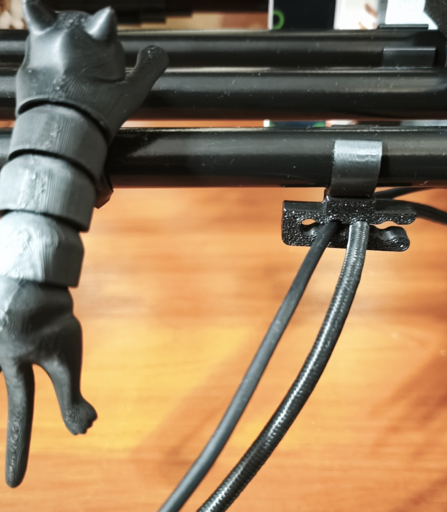
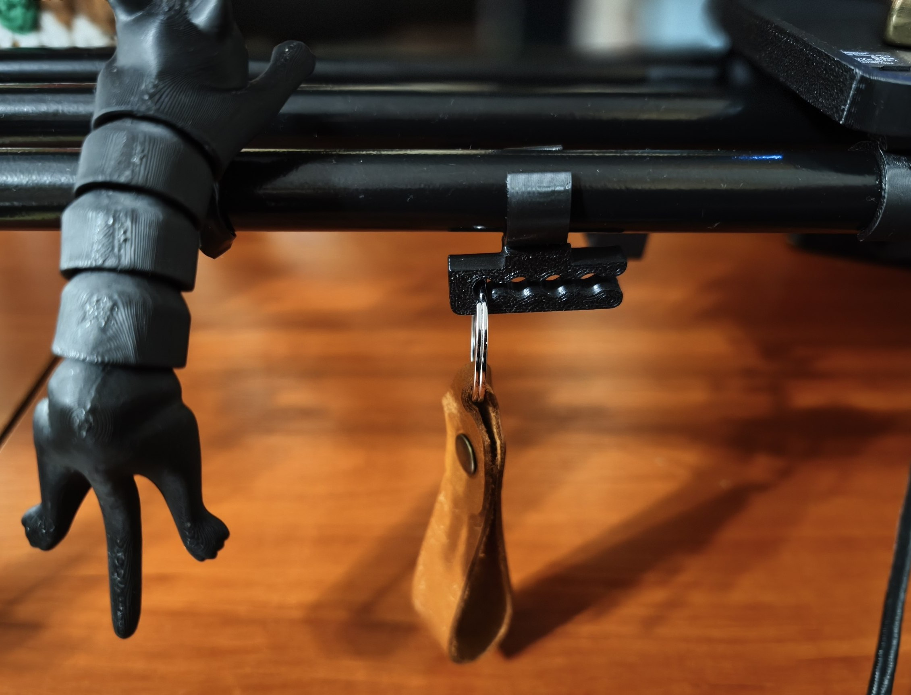
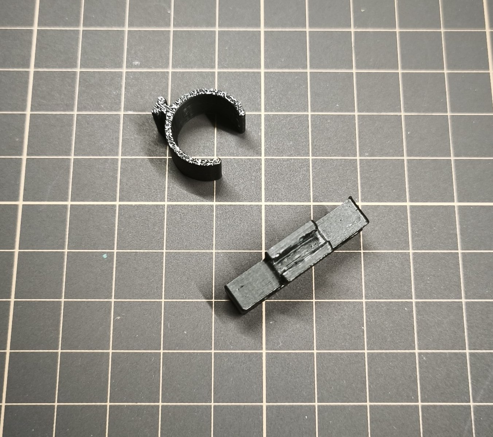
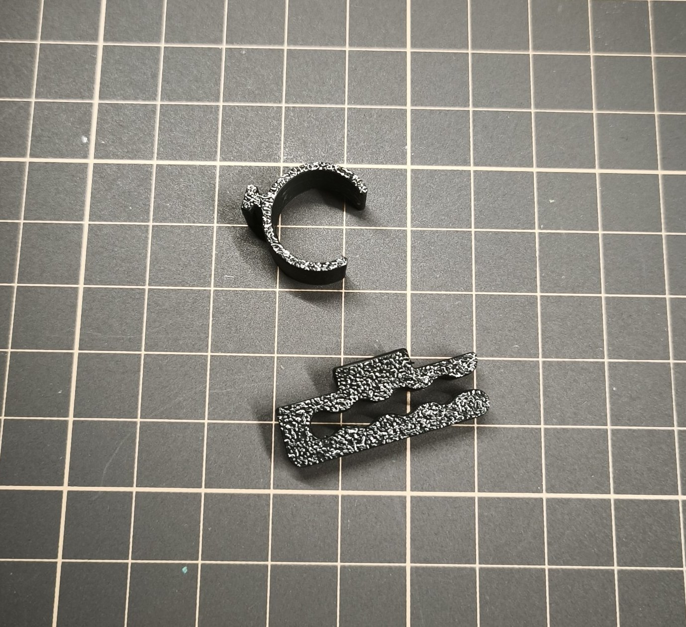
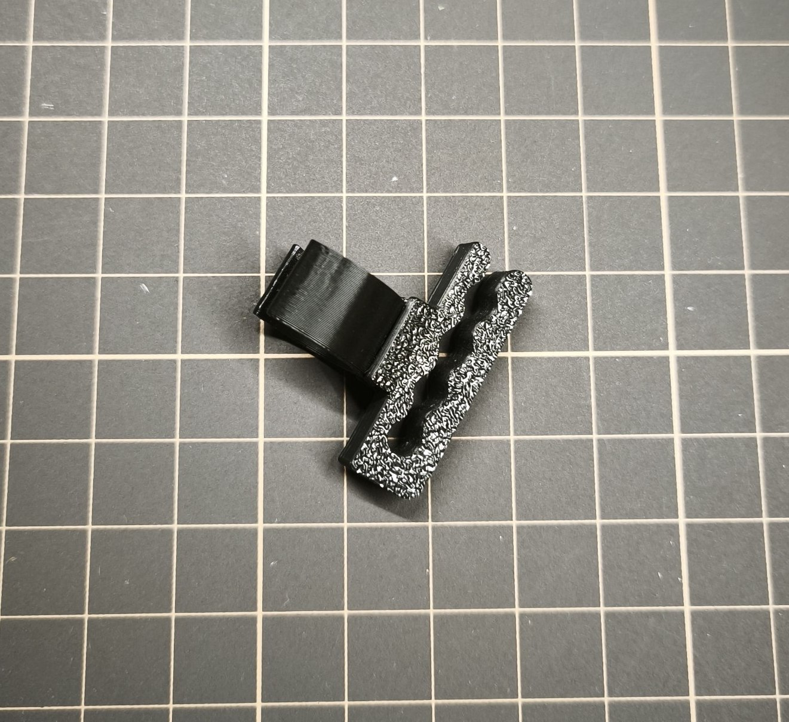

# Cables holder

TDS-compatible accessory that keeps your keyboard, mouse, or other cables organized. You can also use it to hang small
accessories or tools

## Specs

### Required materials

**Filament required:** ~3g

## Files

- [Bambu Studio .3mf file](cables-holder.3mf)
- [Fusion .f3d file](cables-holder.f3d)
- [.step file](cables-holder.step)

## Preview

### 3D

### Printed

