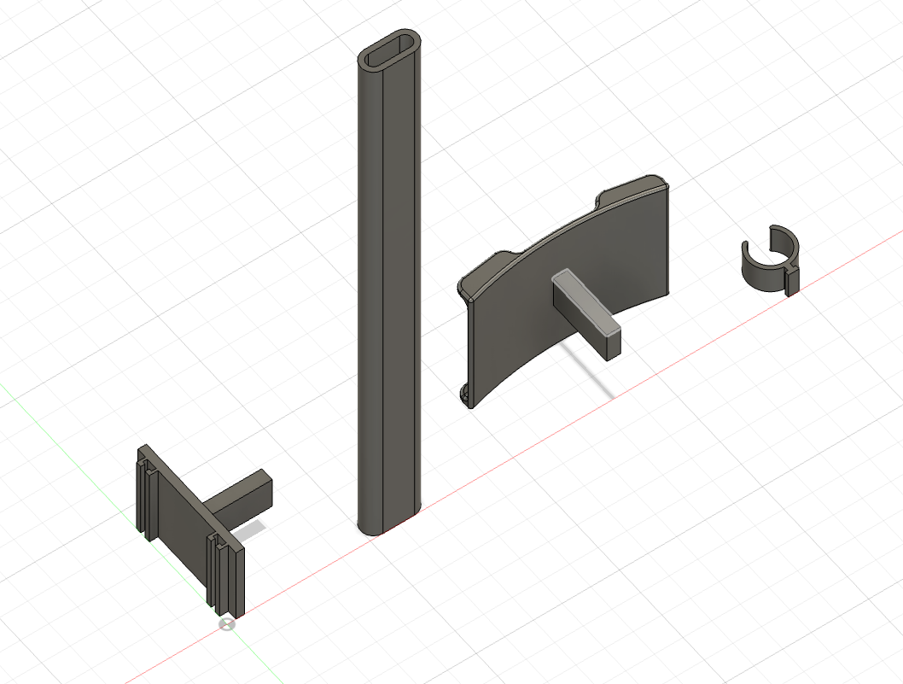
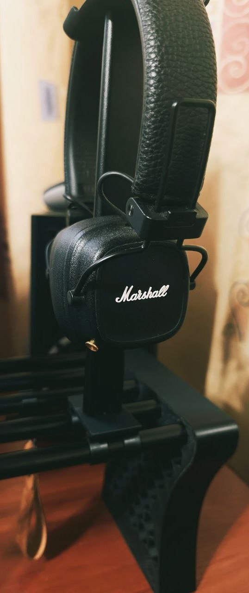

# Headphones stand

TDS-compatible headphones stand, designed to integrate with the shelf’s tube system, providing a stable and space-saving
mounting solution for your headphones

## Specs

### Required materials

**Filament required:** ~46g

## Files

- [Bambu Studio .3mf file](headphones-stand.3mf)
- [Fusion .f3d file](headphones-stand.f3d)
- [.step file](headphones-stand.step)

## Preview

### 3D

### Printed

