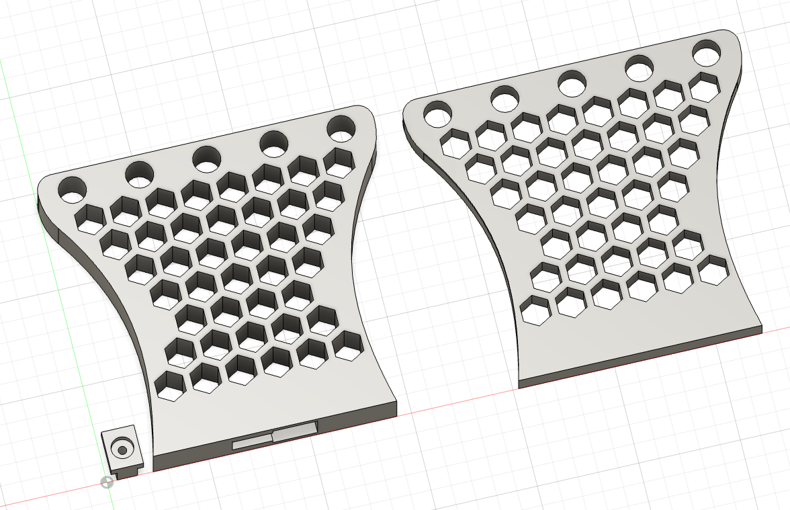

# Intermediate Supports

This extension provides optional structural reinforcement for high-payload scenarios. It is designed to interface
seamlessly with the existing architecture when center-loading (e.g. monitor, etc.) is required

Supports utilize a 13.6mm bore, engineered for a high-clearance "slide-on" fit to ensure effortless positioning
along the support tubes. For users seeking a secure but non-permanent installation, the base is compatible with
double-sided adhesive tape to prevent shifting during use, as the component's main function is to manage vertical
pressure

**Supports come in two designs**

- **Mountable:** includes an integrated base for direct desktop fixation
- **Slim:** a minimalist profile optimized for vertical bracing with a reduced footprint

## Specs

### Required materials

- **Mountable support**
    - ~144g of PLA filament
    - 2 x M4 x 30mm screws
        - The screws length depends on your desk thickness
- **Slim support**
    - ~80g of PLA filament

## Materials

- [Bambu Studio .3mf file](intermediate-supports.3mf)
- [Fusion .f3d file](intermediate-supports.f3d)
- [.step file](intermediate-supports.step)

## Preview

### 3D

