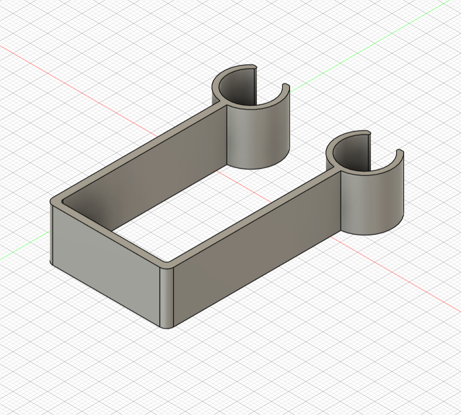
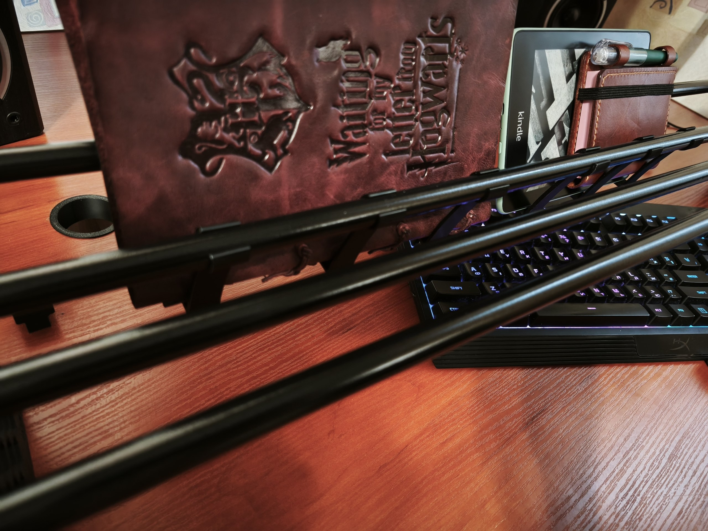
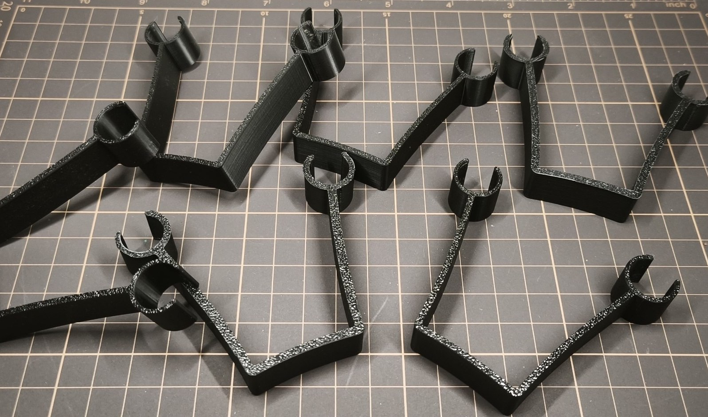
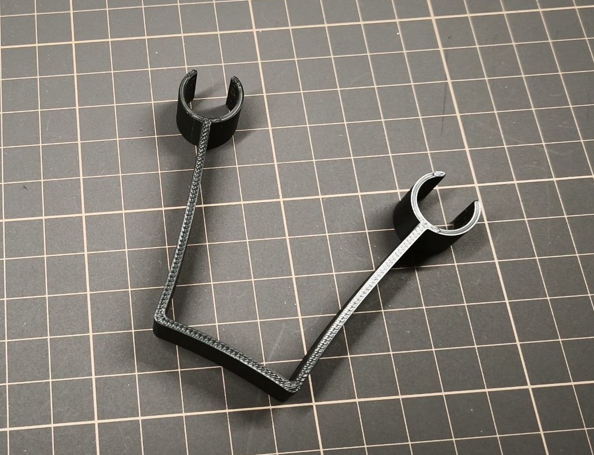
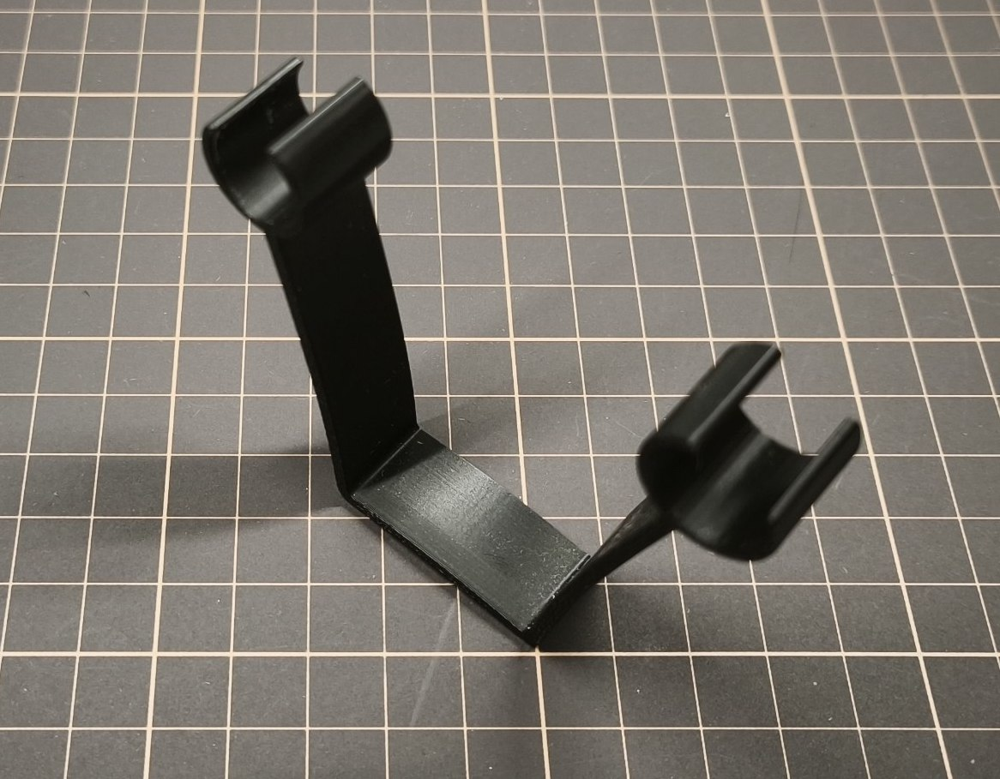

### Notebook holder

TDS-compatible flexible holder that attaches to the shelf’s tube system and can hold notebooks, books, or other flat
items. It can be mounted between neighboring or more distant tubes

## Specs

### Required materials

**Filament required:** ~14g for the pair

## Files

- [Bambu Studio .3mf file](notebook-holder.3mf)
- [Fusion .f3d file](notebook-holder.f3d)
- [.step file](notebook-holder.step)

## Preview

### 3D

### Printed

