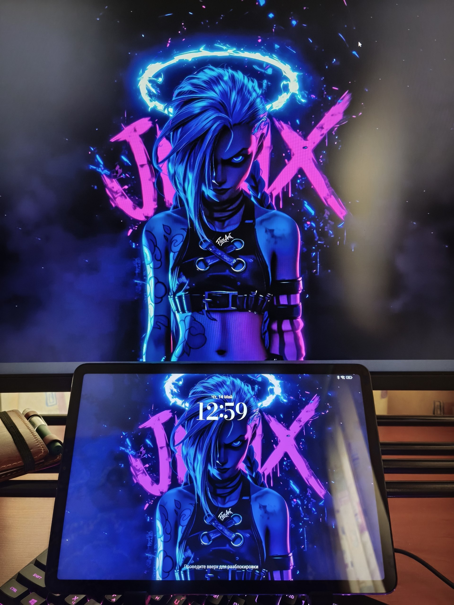
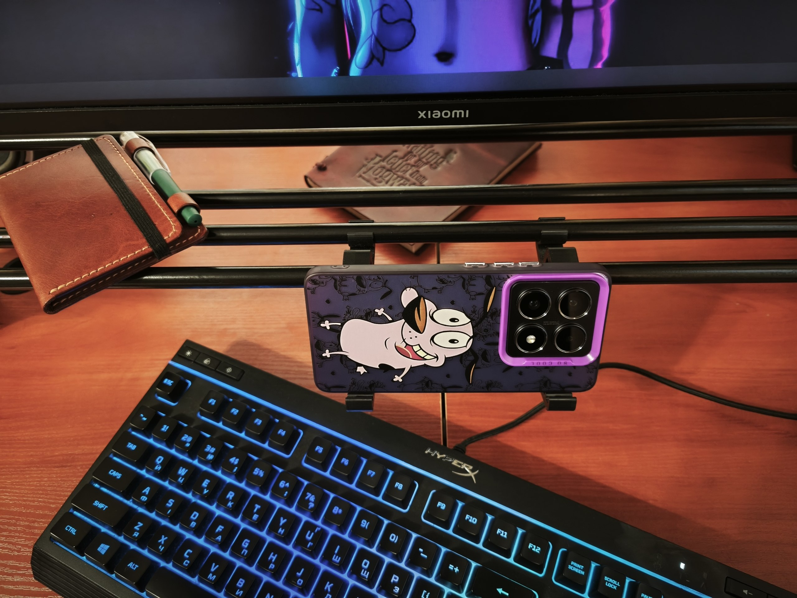
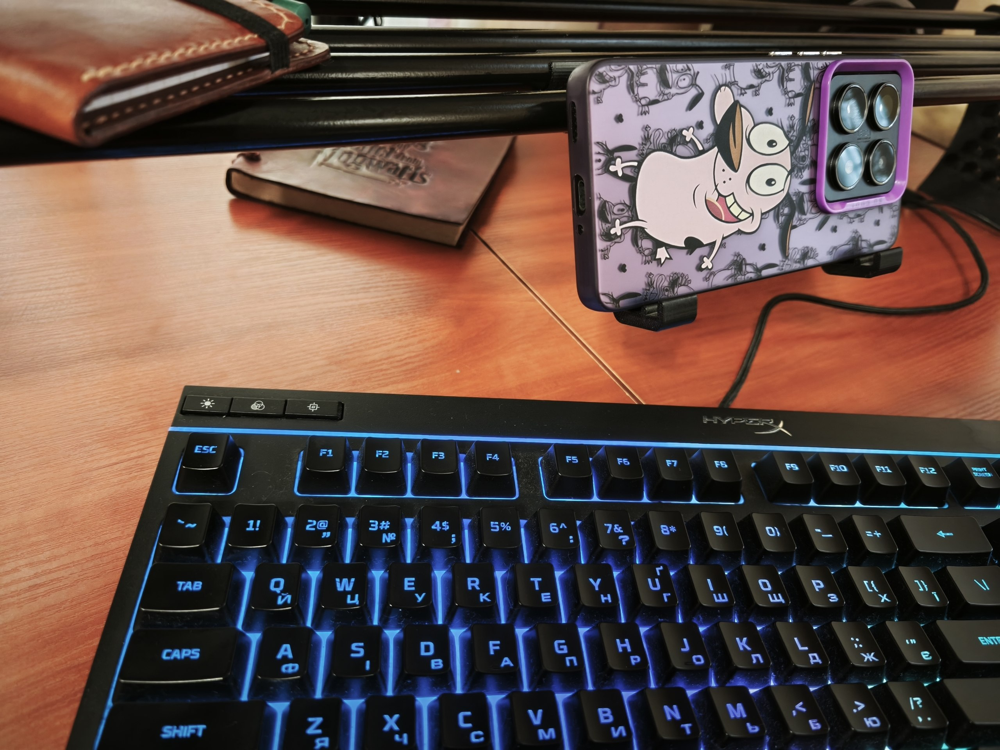
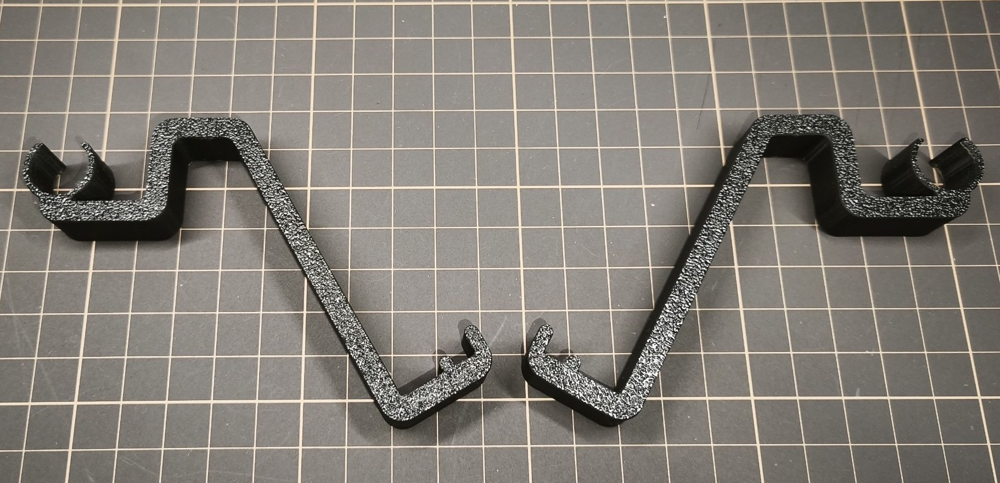
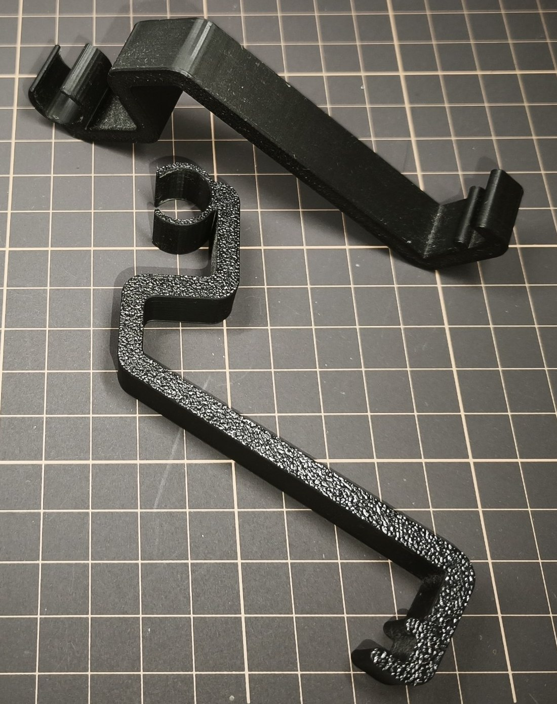

# Phone stand

TDS-compatible width-adjustable stand suitable for holding various devices such as phones, tablets, e-readers, etc.

## Specs

### Required materials

**Filament required:** ~22g for the pair

## Files

- [Bambu Studio .3mf file](phone-stand.3mf)
- [Fusion .f3d file](phone-stand.f3d)
- [.step file](phone-stand.step)

## Preview

### 3D

### Printed

