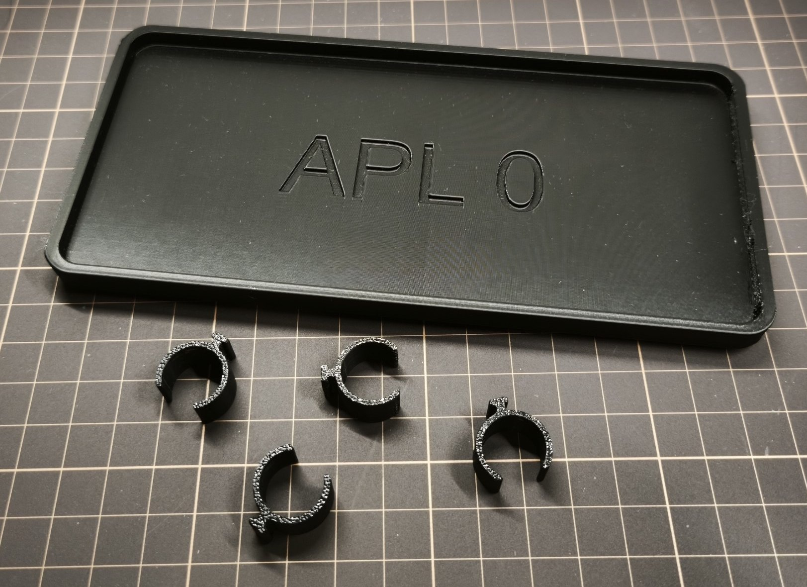
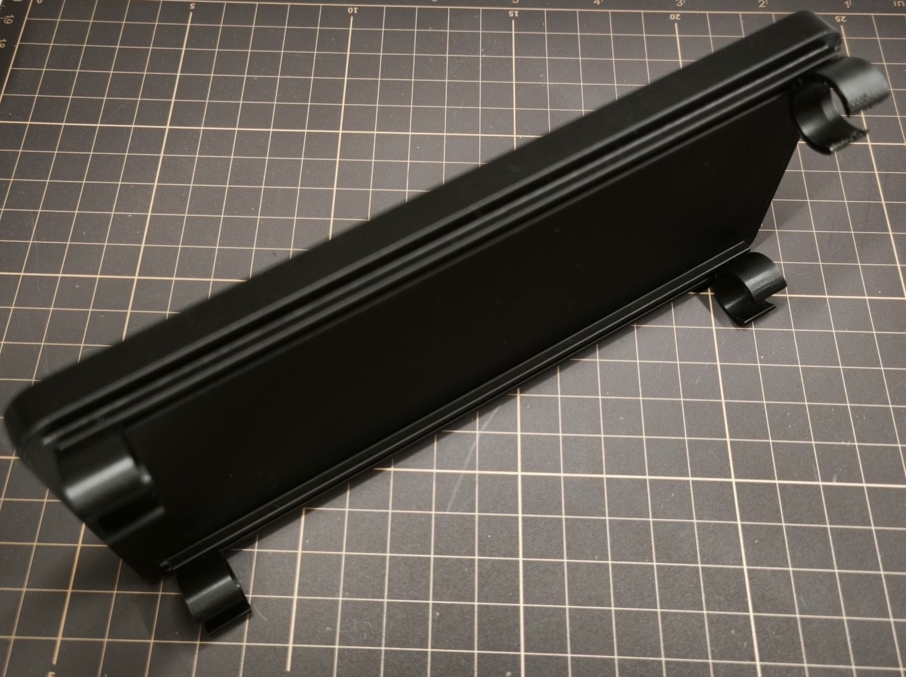
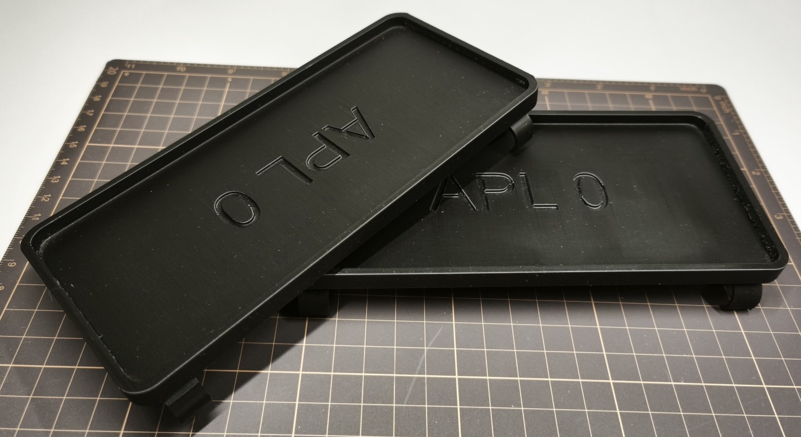

# Tray

TDS-compatible tray accessory, that provides convenient storage for frequently used pens, cables, and small items

## Specs

### Required materials

**Filament required:** ~59g

## Files

- [Bambu Studio .3mf file](tray.3mf)
- [Fusion .f3d file](tray.f3d)
- [.step file](tray.step)

## Preview

### 3D

### Printed

