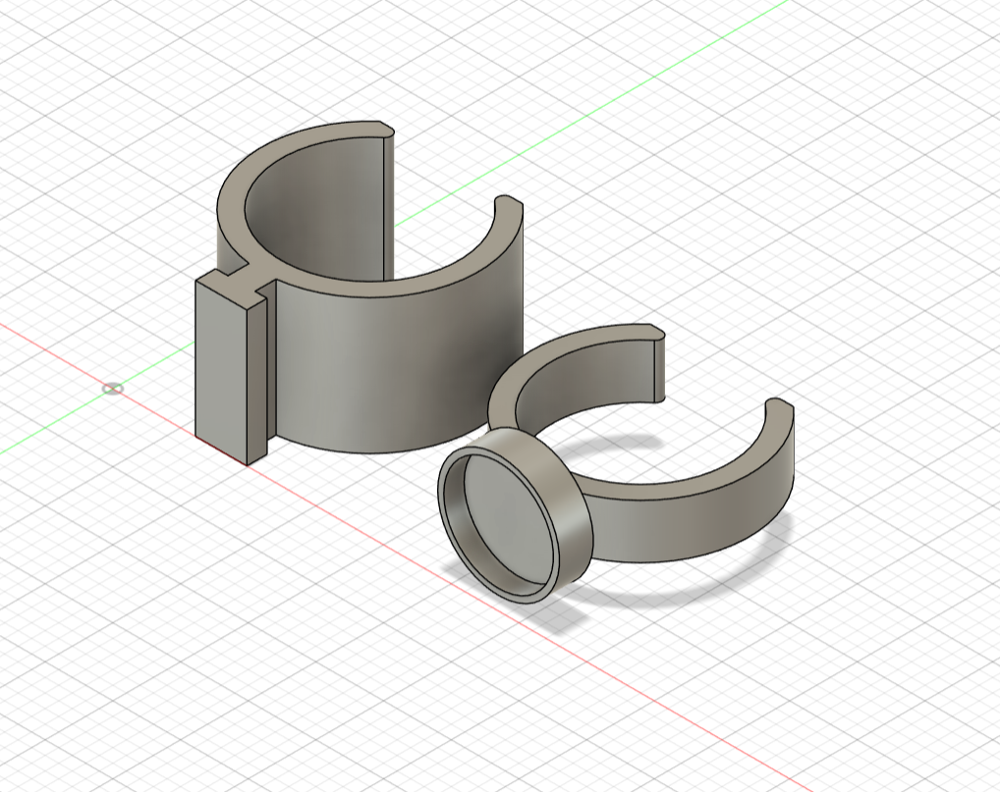

### Tube brackets

Brackets that serve as mounting points for the shelf’s tube system.  
They can also be combined with accessories to provide additional mounting positions or support.  
One of the bracket variants includes a slot for an 8 mm diameter constant magnet

**Filament required:** ~1.3g

