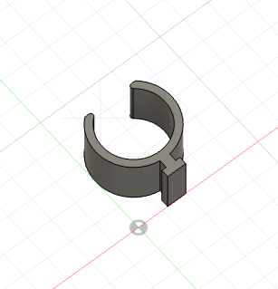

### Tube brackets

Brackets that serve as mounting points for the shelf’s tube system.  
They can also be combined with accessories to provide additional mounting positions or support

**Filament required:** ~1g

