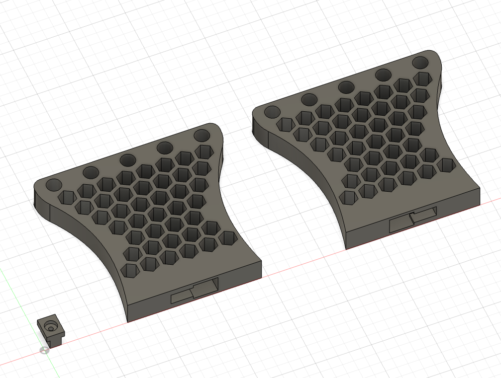
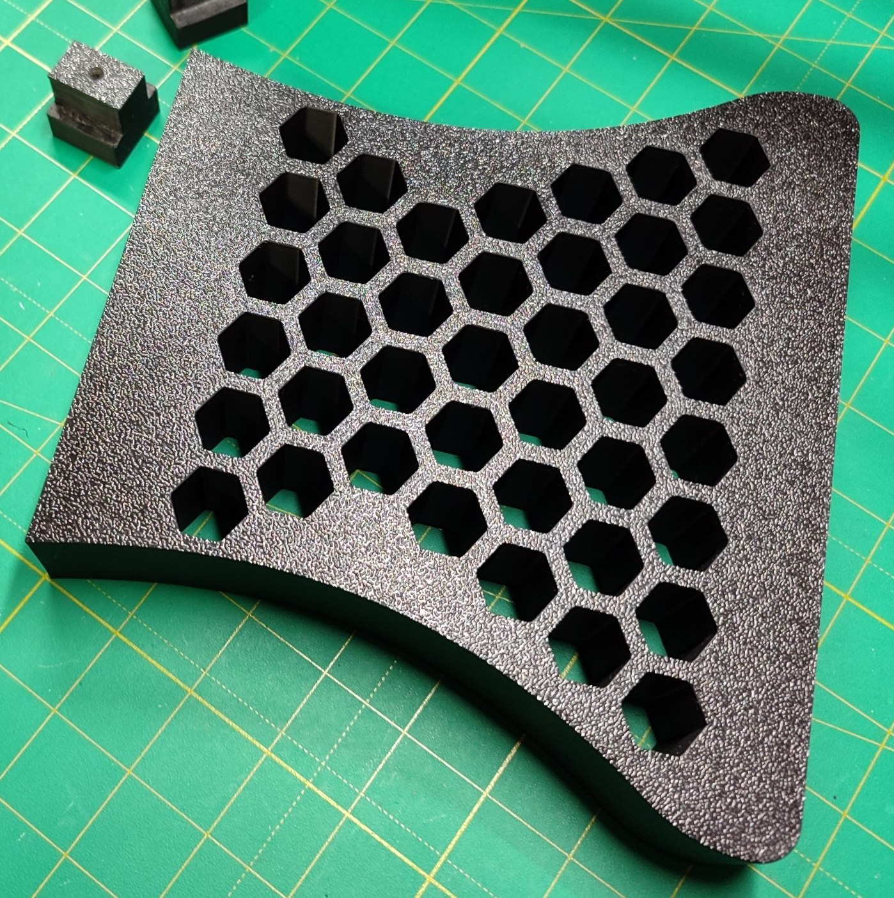
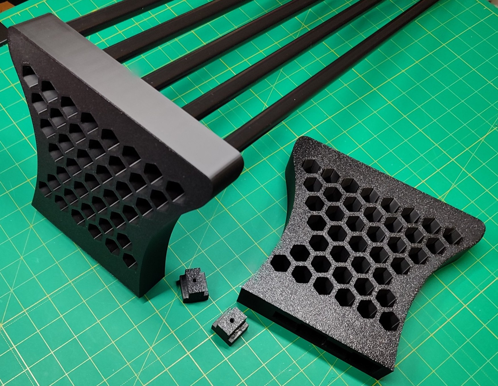

# TDS | Tubed Desk Shelf

**TDS** is an open-source, 3D-printable modular system designed to organize and elevate your workspace.
The structure is built around five 13mm-diameter tubes/rods of any material - such as aluminum, wood, or carbon
fiber. Secure it to your workspace using the dedicated table mounts and expand its functionality with the initial set of
compatible accessories, or design your own custom additions. I also welcome your ideas and proposals for future
expansions

## Specs

### Dimensions

- **Height:** 150mm
- ⚠️ Keep in mind that some accessories, or certain ways of using them, may require additional vertical space - consider
  this when positioning the shelf
- **Distance between tube centers:** 33.1 mm
- **Distance between tubes:** 20 mm

### Required materials

- ~292g of PLA filament
- 5 tubes/rods with a 13mm outer diameter
- 2 x M4 x 30mm screws
    - The screws length depends on your desk thickness

### Installation

- Slide your tubes or rods into the designated openings on each side of the shelf stand
- The number of tubes/rods and their configuration can be adjusted based on your specific needs and workspace
  requirements
- Choose the desired position for your shelf
- ⚠️ When marking the holes, keep in mind that each screw hole should be
  positioned **~39mm behind the front edge of the side stand** - this ensures that the shelf will sit exactly
  where you want it on your desk
- To secure the mounts, drill one hole into the tabletop for an M4 screw on each side of the shelf
- Secure the mounts with M4 screws, which can be threaded straight into the mount itself
- Place the side stands onto the installed shelf mounts and slide them away from you (toward the back
  of the desk) until they lock in place

## Materials

- [Bambu Studio .3mf file](tubed-desk-shelf.3mf)
- [Fusion .f3d file](tubed-desk-shelf.f3d)
- [.step file](tubed-desk-shelf.step)

## Preview

### 3D

### Printed

